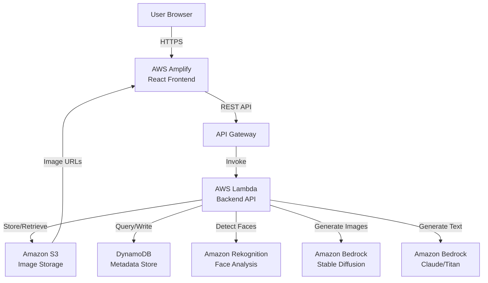
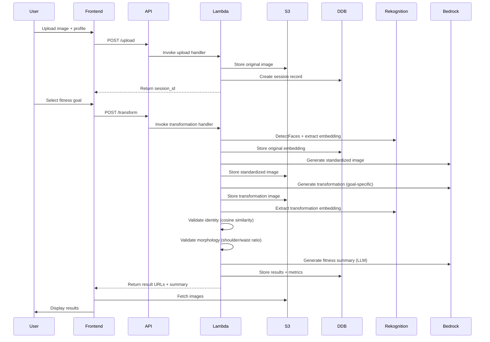

# Design Document: Fitness Visualization Platform

## Overview

The Fitness Visualization Platform is a serverless, AI-powered application that generates photorealistic upper-body physique transformations while preserving user identity. The system uses a multi-stage pipeline combining AWS AI services (Rekognition, Bedrock) with custom validation logic to produce realistic, goal-specific transformations.

The architecture follows a decoupled design with a React frontend hosted on AWS Amplify, a serverless backend on AWS Lambda, and AWS managed services for storage (S3), database (DynamoDB), and AI capabilities (Rekognition, Bedrock). The transformation pipeline processes user images through face detection, identity extraction, AI-powered image generation, and multi-metric validation to ensure quality and realism.

Key design principles:
- **Identity Preservation**: Facial embeddings ensure recognizability across transformations
- **Realistic Constraints**: Transformations simulate achievable 1-2 year fitness progression
- **Validation-Driven Quality**: Multiple validation layers (identity similarity, morphological metrics) ensure output quality
- **Serverless Scalability**: AWS Lambda and managed services provide automatic scaling
- **Fast Feedback**: Sub-10-second pipeline with progress indicators

## Architecture

### High-Level Architecture



### Component Architecture

The system is organized into the following components:

1. **Frontend Layer** (React on AWS Amplify)
   - User interface for image upload, profile entry, goal selection
   - Results display with side-by-side comparison
   - Progress indicators and error handling

2. **API Layer** (AWS API Gateway + Lambda)
   - RESTful endpoints for upload, transformation, and retrieval
   - Request validation and session management
   - Orchestration of transformation pipeline

3. **Transformation Pipeline** (Lambda Functions)
   - Image preprocessing and validation
   - Face detection and identity extraction
   - AI-powered image generation
   - Multi-stage validation
   - Fitness summary generation

4. **Storage Layer** (S3 + DynamoDB)
   - S3: Original images, standardized images, transformation images
   - DynamoDB: User sessions, metadata, validation metrics

5. **AI Services Layer** (AWS Managed)
   - Amazon Rekognition: Face detection, landmarks, embeddings
   - Amazon Bedrock Stable Diffusion: Image-to-image transformation
   - Amazon Bedrock LLM: Fitness summary generation

### Data Flow



## Components and Interfaces

### 1. Frontend Application (React + AWS Amplify)

**Responsibilities:**
- Render user interface for upload, profile entry, goal selection
- Handle client-side validation (file type, size, input ranges)
- Display transformation results with side-by-side comparison
- Provide download functionality for transformation images
- Show loading states and error messages

**Key Interfaces:**
```typescript
interface UploadRequest {
  image: File;  // JPEG, PNG, or WebP, max 10MB
}

interface UploadResponse {
  session_id: string;
  image_url: string;
}

interface TransformRequest {
  session_id: string;
  height_cm: number;  // 150-220
  weight_kg: number;  // 45-200
  fitness_goal: 'lean' | 'athletic' | 'bulky';
}

interface TransformResponse {
  session_id: string;
  standardized_image_url: string;
  transformation_image_url: string;
  fitness_summary: string;
  similarity_score: number;
  shoulder_waist_ratio: number;
  processing_time_ms: number;
}

interface ErrorResponse {
  error: string;
  message: string;
  retry_allowed: boolean;
}
```

**Technology Stack:**
- React 18+ with functional components and hooks
- Axios or Fetch API for HTTP requests
- AWS Amplify hosting with CI/CD
- Responsive CSS (Tailwind or Material-UI)

### 2. API Gateway

**Responsibilities:**
- Expose REST endpoints for frontend communication
- Handle CORS configuration
- Route requests to appropriate Lambda functions
- Provide request/response transformation

**Endpoints:**
```
POST /api/upload
  - Body: multipart/form-data with image file
  - Response: { session_id, image_url }

POST /api/transform
  - Body: { session_id, height_cm, weight_kg, fitness_goal }
  - Response: { standardized_image_url, transformation_image_url, fitness_summary, ... }

GET /api/results/{session_id}
  - Response: { standardized_image_url, transformation_image_url, fitness_summary, ... }
```

**Configuration:**
- CORS enabled for Amplify domain
- Request validation for required fields
- Rate limiting (optional for MVP)
- CloudWatch logging enabled

### 3. Backend Lambda Functions

#### 3.1 Upload Handler

**Responsibilities:**
- Validate uploaded image (format, size)
- Generate unique session ID
- Store original image in S3
- Create session record in DynamoDB
- Return session ID and image URL

**Implementation:**
```python
def lambda_handler(event, context):
    # Parse multipart form data
    image_data = parse_image_from_event(event)
    
    # Validate image
    if not validate_image_format(image_data):
        return error_response(400, "Invalid image format")
    
    if not validate_image_size(image_data, max_mb=10):
        return error_response(400, "Image too large")
    
    # Generate session ID
    session_id = generate_uuid()
    
    # Store in S3
    s3_key = f"originals/{session_id}.jpg"
    s3_client.put_object(
        Bucket=BUCKET_NAME,
        Key=s3_key,
        Body=image_data,
        ContentType="image/jpeg"
    )
    
    # Create DynamoDB record
    ddb_table.put_item(Item={
        'session_id': session_id,
        'upload_timestamp': int(time.time()),
        'original_image_key': s3_key,
        'status': 'uploaded'
    })
    
    return success_response({
        'session_id': session_id,
        'image_url': generate_presigned_url(s3_key)
    })
```

#### 3.2 Transformation Handler

**Responsibilities:**
- Orchestrate the complete transformation pipeline
- Perform face detection and identity extraction
- Generate standardized and transformation images
- Validate identity preservation and morphological differentiation
- Generate fitness summary
- Store all results and metrics

**Pipeline Stages:**

**Stage 1: Face Detection and Identity Extraction**
```python
def extract_face_identity(image_s3_key):
    # Download image from S3
    image_bytes = s3_client.get_object(
        Bucket=BUCKET_NAME,
        Key=image_s3_key
    )['Body'].read()
    
    # Detect faces using Rekognition
    response = rekognition_client.detect_faces(
        Image={'Bytes': image_bytes},
        Attributes=['ALL']
    )
    
    if len(response['FaceDetails']) == 0:
        raise NoFaceDetectedError("No face found in image")
    
    # Extract facial landmarks
    face_details = response['FaceDetails'][0]
    landmarks = face_details['Landmarks']
    
    # Get face embedding for identity
    search_response = rekognition_client.search_faces_by_image(
        CollectionId=FACE_COLLECTION_ID,
        Image={'Bytes': image_bytes},
        MaxFaces=1
    )
    
    # If no match, index the face to get embedding
    if len(search_response['FaceMatches']) == 0:
        index_response = rekognition_client.index_faces(
            CollectionId=FACE_COLLECTION_ID,
            Image={'Bytes': image_bytes},
            MaxFaces=1,
            DetectionAttributes=['ALL']
        )
        face_id = index_response['FaceRecords'][0]['Face']['FaceId']
    else:
        face_id = search_response['FaceMatches'][0]['Face']['FaceId']
    
    return {
        'face_id': face_id,
        'landmarks': landmarks,
        'bounding_box': face_details['BoundingBox']
    }
```

**Stage 2: Standardized Image Generation**
```python
def generate_standardized_image(original_image_key, face_data):
    # Download original image
    image_bytes = s3_client.get_object(
        Bucket=BUCKET_NAME,
        Key=original_image_key
    )['Body'].read()
    
    # Convert to base64 for Bedrock
    image_base64 = base64.b64encode(image_bytes).decode('utf-8')
    
    # Prepare Bedrock request for standardization
    # Use low denoising to preserve original while standardizing pose/lighting
    request_body = {
        "text_prompts": [
            {"text": "front-facing upper body photo, neutral pose, clear lighting, professional photo", "weight": 1.0}
        ],
        "init_image": image_base64,
        "cfg_scale": 7.0,
        "steps": 30,
        "strength": 0.25,  # Low strength to preserve original
        "seed": 42
    }
    
    # Invoke Bedrock Stable Diffusion
    response = bedrock_client.invoke_model(
        modelId="stability.stable-diffusion-xl-v1",
        body=json.dumps(request_body)
    )
    
    # Parse response
    response_body = json.loads(response['body'].read())
    standardized_image_base64 = response_body['artifacts'][0]['base64']
    standardized_image_bytes = base64.b64decode(standardized_image_base64)
    
    # Store in S3
    standardized_key = f"standardized/{session_id}.jpg"
    s3_client.put_object(
        Bucket=BUCKET_NAME,
        Key=standardized_key,
        Body=standardized_image_bytes,
        ContentType="image/jpeg"
    )
    
    return standardized_key
```

**Stage 3: Goal-Specific Transformation Generation**
```python
def generate_transformation(standardized_image_key, fitness_goal, height_cm, weight_kg):
    # Download standardized image
    image_bytes = s3_client.get_object(
        Bucket=BUCKET_NAME,
        Key=standardized_image_key
    )['Body'].read()
    
    image_base64 = base64.b64encode(image_bytes).decode('utf-8')
    
    # Define goal-specific prompts
    goal_prompts = {
        'lean': {
            'positive': "lean athletic physique, 12-15% body fat, slim waist, light muscle definition, toned shoulders and arms, defined jawline, natural lighting, photorealistic",
            'negative': "bulky, overly muscular, bodybuilder, exaggerated, cartoon, distorted face",
            'strength': 0.40
        },
        'athletic': {
            'positive': "athletic muscular physique, balanced definition, broad shoulders, defined chest, moderate arms, 10-14% body fat, natural proportions, photorealistic",
            'negative': "skinny, bulky bodybuilder, exaggerated muscles, cartoon, distorted face",
            'strength': 0.45
        },
        'bulky': {
            'positive': "muscular physique, increased muscle mass, thick chest, larger arms, strong upper frame, broad shoulders, natural proportions, photorealistic",
            'negative': "skinny, extreme bodybuilder, unrealistic proportions, cartoon, distorted face",
            'strength': 0.50
        }
    }
    
    prompt_config = goal_prompts[fitness_goal]
    
    # Prepare Bedrock request
    request_body = {
        "text_prompts": [
            {"text": prompt_config['positive'], "weight": 1.0},
            {"text": prompt_config['negative'], "weight": -1.0}
        ],
        "init_image": image_base64,
        "cfg_scale": 8.0,
        "steps": 50,
        "strength": prompt_config['strength'],
        "seed": random.randint(1, 1000000)
    }
    
    # Invoke Bedrock Stable Diffusion
    response = bedrock_client.invoke_model(
        modelId="stability.stable-diffusion-xl-v1",
        body=json.dumps(request_body)
    )
    
    # Parse and store
    response_body = json.loads(response['body'].read())
    transformation_image_base64 = response_body['artifacts'][0]['base64']
    transformation_image_bytes = base64.b64decode(transformation_image_base64)
    
    transformation_key = f"transformations/{session_id}_{fitness_goal}.jpg"
    s3_client.put_object(
        Bucket=BUCKET_NAME,
        Key=transformation_key,
        Body=transformation_image_bytes,
        ContentType="image/jpeg"
    )
    
    return transformation_key
```

**Stage 4: Identity Validation**
```python
def validate_identity_preservation(original_face_id, transformation_image_key):
    # Extract face from transformation
    transformation_bytes = s3_client.get_object(
        Bucket=BUCKET_NAME,
        Key=transformation_image_key
    )['Body'].read()
    
    # Detect face in transformation
    detect_response = rekognition_client.detect_faces(
        Image={'Bytes': transformation_bytes},
        Attributes=['ALL']
    )
    
    if len(detect_response['FaceDetails']) == 0:
        raise ValidationError("No face detected in transformation")
    
    # Compare faces using Rekognition
    compare_response = rekognition_client.compare_faces(
        SourceImage={'Bytes': get_image_bytes_by_face_id(original_face_id)},
        TargetImage={'Bytes': transformation_bytes},
        SimilarityThreshold=0.0  # Get actual score
    )
    
    if len(compare_response['FaceMatches']) == 0:
        return 0.0  # No match found
    
    similarity_score = compare_response['FaceMatches'][0]['Similarity'] / 100.0
    
    # Validate threshold
    if similarity_score < 0.8:
        raise ValidationError(f"Identity preservation failed: {similarity_score:.2f} < 0.8")
    
    return similarity_score
```

**Stage 5: Morphological Validation**
```python
def calculate_shoulder_waist_ratio(image_key):
    # Download image
    image_bytes = s3_client.get_object(
        Bucket=BUCKET_NAME,
        Key=image_key
    )['Body'].read()
    
    # Use Rekognition to detect body landmarks (if available)
    # Or use custom CV logic with OpenCV
    image = cv2.imdecode(np.frombuffer(image_bytes, np.uint8), cv2.IMREAD_COLOR)
    
    # Detect shoulders and waist using pose estimation or edge detection
    # This is a simplified approach - production would use pose estimation models
    gray = cv2.cvtColor(image, cv2.COLOR_BGR2GRAY)
    edges = cv2.Canny(gray, 50, 150)
    
    # Find contours and estimate shoulder/waist widths
    # Shoulder region: upper 30-40% of image
    # Waist region: middle 50-60% of image
    height, width = image.shape[:2]
    
    shoulder_region = edges[int(height*0.3):int(height*0.4), :]
    waist_region = edges[int(height*0.5):int(height*0.6), :]
    
    shoulder_width = estimate_body_width(shoulder_region)
    waist_width = estimate_body_width(waist_region)
    
    ratio = shoulder_width / waist_width if waist_width > 0 else 0
    
    return ratio

def estimate_body_width(region):
    # Find leftmost and rightmost edge pixels in middle rows
    middle_rows = region[region.shape[0]//3:2*region.shape[0]//3, :]
    
    # For each row, find leftmost and rightmost white pixels
    widths = []
    for row in middle_rows:
        white_pixels = np.where(row > 0)[0]
        if len(white_pixels) > 0:
            width = white_pixels[-1] - white_pixels[0]
            widths.append(width)
    
    return np.median(widths) if widths else 0
```

**Stage 6: Fitness Summary Generation**
```python
def generate_fitness_summary(height_cm, weight_kg, fitness_goal):
    # Calculate BMI for context
    height_m = height_cm / 100
    bmi = weight_kg / (height_m ** 2)
    
    # Prepare prompt for LLM
    prompt = f"""Generate a concise fitness direction summary (100-300 words) for someone with the following profile:
- Height: {height_cm} cm
- Weight: {weight_kg} kg
- BMI: {bmi:.1f}
- Fitness Goal: {fitness_goal.capitalize()}

Provide general guidance on:
1. Training focus (strength, hypertrophy, conditioning)
2. Approximate timeline (realistic 1-2 year progression)
3. Key muscle groups to target
4. General lifestyle factors

Keep the tone motivational and realistic. Do not provide specific medical advice, meal plans, or supplement recommendations."""
    
    # Invoke Bedrock LLM (Claude or Titan)
    request_body = {
        "prompt": f"\n\nHuman: {prompt}\n\nAssistant:",
        "max_tokens_to_sample": 500,
        "temperature": 0.7,
        "top_p": 0.9
    }
    
    response = bedrock_client.invoke_model(
        modelId="anthropic.claude-v2",
        body=json.dumps(request_body)
    )
    
    response_body = json.loads(response['body'].read())
    summary = response_body['completion'].strip()
    
    return summary
```

**Main Transformation Handler**
```python
def lambda_handler(event, context):
    start_time = time.time()
    
    # Parse request
    body = json.loads(event['body'])
    session_id = body['session_id']
    height_cm = body['height_cm']
    weight_kg = body['weight_kg']
    fitness_goal = body['fitness_goal']
    
    # Validate inputs
    if not (150 <= height_cm <= 220):
        return error_response(400, "Height must be between 150-220 cm")
    if not (45 <= weight_kg <= 200):
        return error_response(400, "Weight must be between 45-200 kg")
    if fitness_goal not in ['lean', 'athletic', 'bulky']:
        return error_response(400, "Invalid fitness goal")
    
    # Get session data
    session = ddb_table.get_item(Key={'session_id': session_id})['Item']
    original_image_key = session['original_image_key']
    
    retry_count = 0
    max_retries = 2
    
    while retry_count <= max_retries:
        try:
            # Stage 1: Extract face identity
            face_data = extract_face_identity(original_image_key)
            
            # Stage 2: Generate standardized image
            standardized_key = generate_standardized_image(original_image_key, face_data)
            
            # Stage 3: Generate transformation
            transformation_key = generate_transformation(
                standardized_key, fitness_goal, height_cm, weight_kg
            )
            
            # Stage 4: Validate identity
            similarity_score = validate_identity_preservation(
                face_data['face_id'], transformation_key
            )
            
            # Stage 5: Validate morphology
            shoulder_waist_ratio = calculate_shoulder_waist_ratio(transformation_key)
            
            # Stage 6: Generate fitness summary
            fitness_summary = generate_fitness_summary(height_cm, weight_kg, fitness_goal)
            
            # Success - break retry loop
            break
            
        except ValidationError as e:
            retry_count += 1
            if retry_count > max_retries:
                return error_response(500, f"Transformation failed validation: {str(e)}")
            # Retry with different seed
            continue
    
    # Store results in DynamoDB
    processing_time_ms = int((time.time() - start_time) * 1000)
    
    ddb_table.update_item(
        Key={'session_id': session_id},
        UpdateExpression="SET standardized_image_key = :std, transformation_image_key = :trans, fitness_goal = :goal, similarity_score = :sim, shoulder_waist_ratio = :ratio, fitness_summary = :summary, processing_time_ms = :time, #status = :status",
        ExpressionAttributeNames={'#status': 'status'},
        ExpressionAttributeValues={
            ':std': standardized_key,
            ':trans': transformation_key,
            ':goal': fitness_goal,
            ':sim': Decimal(str(similarity_score)),
            ':ratio': Decimal(str(shoulder_waist_ratio)),
            ':summary': fitness_summary,
            ':time': processing_time_ms,
            ':status': 'completed'
        }
    )
    
    # Return results
    return success_response({
        'session_id': session_id,
        'standardized_image_url': generate_presigned_url(standardized_key),
        'transformation_image_url': generate_presigned_url(transformation_key),
        'fitness_summary': fitness_summary,
        'similarity_score': float(similarity_score),
        'shoulder_waist_ratio': float(shoulder_waist_ratio),
        'processing_time_ms': processing_time_ms
    })
```

### 4. Storage Components

#### 4.1 S3 Bucket Structure

```
fitness-viz-bucket/
├── originals/
│   └── {session_id}.jpg
├── standardized/
│   └── {session_id}.jpg
└── transformations/
    └── {session_id}_{goal}.jpg
```

**Configuration:**
- Server-side encryption enabled (AES-256)
- Lifecycle policy: Delete objects after 7 days (MVP)
- CORS configuration for frontend access
- Presigned URLs for secure image access (15-minute expiration)

#### 4.2 DynamoDB Table Schema

**Table Name:** `fitness-transformations`

**Primary Key:**
- Partition Key: `session_id` (String)

**Attributes:**
```
{
  "session_id": "uuid-string",
  "upload_timestamp": 1234567890,
  "original_image_key": "originals/uuid.jpg",
  "standardized_image_key": "standardized/uuid.jpg",
  "transformation_image_key": "transformations/uuid_lean.jpg",
  "fitness_goal": "lean" | "athletic" | "bulky",
  "height_cm": 175,
  "weight_kg": 75,
  "similarity_score": 0.87,
  "shoulder_waist_ratio": 1.45,
  "fitness_summary": "text...",
  "processing_time_ms": 8500,
  "status": "uploaded" | "processing" | "completed" | "failed"
}
```

**Indexes:** None required for MVP (simple key-value lookups)

### 5. AI Service Integration

#### 5.1 Amazon Rekognition

**Usage:**
- Face detection: `DetectFaces` API with `ALL` attributes
- Face comparison: `CompareFaces` API for identity validation
- Face collection: Optional face indexing for embedding storage

**Configuration:**
- Minimum confidence threshold: 90% for face detection
- Similarity threshold: 80% for identity preservation

#### 5.2 Amazon Bedrock - Stable Diffusion

**Model:** `stability.stable-diffusion-xl-v1`

**Parameters:**
- **Standardized Image:**
  - Strength: 0.25 (low modification)
  - CFG Scale: 7.0
  - Steps: 30
  
- **Transformation Image:**
  - Strength: 0.35-0.50 (goal-dependent)
  - CFG Scale: 8.0
  - Steps: 50
  - Seed: Random for variation

**Prompt Engineering:**
- Positive prompts emphasize photorealism, natural proportions, specific physique characteristics
- Negative prompts prevent cartoon style, face distortion, unrealistic proportions

#### 5.3 Amazon Bedrock - LLM

**Model:** `anthropic.claude-v2` or `amazon.titan-text-express-v1`

**Parameters:**
- Max tokens: 500
- Temperature: 0.7 (balanced creativity)
- Top-p: 0.9

**Prompt Structure:**
- Context: User height, weight, BMI, fitness goal
- Instructions: Generate 100-300 word summary with training focus, timeline, muscle groups, lifestyle factors
- Constraints: No medical advice, no specific meal plans, no supplements

## Data Models

### Session Model

```typescript
interface Session {
  session_id: string;
  upload_timestamp: number;
  original_image_key: string;
  standardized_image_key?: string;
  transformation_image_key?: string;
  fitness_goal?: 'lean' | 'athletic' | 'bulky';
  height_cm?: number;
  weight_kg?: number;
  similarity_score?: number;
  shoulder_waist_ratio?: number;
  fitness_summary?: string;
  processing_time_ms?: number;
  status: 'uploaded' | 'processing' | 'completed' | 'failed';
}
```

### Face Data Model

```typescript
interface FaceData {
  face_id: string;
  landmarks: Landmark[];
  bounding_box: BoundingBox;
}

interface Landmark {
  Type: string;  // e.g., "eyeLeft", "nose", "mouthLeft"
  X: number;     // Normalized coordinate (0-1)
  Y: number;     // Normalized coordinate (0-1)
}

interface BoundingBox {
  Width: number;
  Height: number;
  Left: number;
  Top: number;
}
```

### Transformation Request Model

```typescript
interface TransformationRequest {
  session_id: string;
  height_cm: number;
  weight_kg: number;
  fitness_goal: 'lean' | 'athletic' | 'bulky';
}
```

### Transformation Result Model

```typescript
interface TransformationResult {
  session_id: string;
  standardized_image_url: string;
  transformation_image_url: string;
  fitness_summary: string;
  similarity_score: number;
  shoulder_waist_ratio: number;
  processing_time_ms: number;
}
```

### Validation Metrics Model

```typescript
interface ValidationMetrics {
  identity_preserved: boolean;
  similarity_score: number;
  similarity_threshold: number;
  morphology_valid: boolean;
  shoulder_waist_ratio: number;
  expected_ratio_range: [number, number];
}
```

## Correctness Properties


A property is a characteristic or behavior that should hold true across all valid executions of a system—essentially, a formal statement about what the system should do. Properties serve as the bridge between human-readable specifications and machine-verifiable correctness guarantees.

### Property Reflection

After analyzing all acceptance criteria, several patterns of redundancy emerged:

1. **Storage Properties**: Multiple requirements test that data is stored in S3/DynamoDB (1.5, 1.6, 3.4, 4.3, 5.4, 6.8, 7.5, 8.4, 9.5, 13.4). These can be consolidated into properties about data persistence round-trips.

2. **Validation Properties**: Input validation for height (2.1) and weight (2.2) follow the same pattern and can be combined into a single property about profile data validation.

3. **Identity Preservation**: Requirements 5.3 and 6.6 both test identity preservation, which is already comprehensively covered by the cosine similarity validation (7.3).

4. **Goal Selection**: Requirements 3.2 and 3.4 both test that goal selection is recorded, which is redundant.

5. **API Endpoint Tests**: Requirements 14.1, 14.2, 14.3 test endpoint existence, which are better tested as integration examples rather than properties.

The consolidated properties focus on:
- Input validation and error handling
- Data persistence round-trips
- Identity preservation validation
- Morphological differentiation
- Transformation generation and storage
- API response consistency

### Core Properties

**Property 1: Image Format Validation**

*For any* uploaded file, if the file format is JPEG, PNG, or WebP, then the Image_Processor should accept it; if the format is any other type, then the Image_Processor should reject it with an appropriate error message.

**Validates: Requirements 1.1**

**Property 2: File Size Validation**

*For any* uploaded file, if the file size is less than 10MB, then the Image_Processor should accept it; if the file size is 10MB or greater, then the Image_Processor should reject it with an appropriate error message.

**Validates: Requirements 1.2**

**Property 3: Image Storage Round-Trip**

*For any* valid uploaded image, storing the image in S3 and then retrieving it by its unique identifier should return the same image data.

**Validates: Requirements 1.5, 5.4, 6.8**

**Property 4: Metadata Persistence**

*For any* uploaded image with associated metadata (timestamp, session ID, image keys), storing the metadata in DynamoDB and then querying by session ID should return all the stored metadata fields.

**Validates: Requirements 1.6, 3.4, 4.3, 7.5, 8.4, 9.5, 13.4**

**Property 5: Profile Data Validation**

*For any* height and weight values, if height is between 150-220 cm and weight is between 45-200 kg, then the System should accept the values; if either value is outside its valid range, then the System should reject the submission with a validation error.

**Validates: Requirements 2.1, 2.2, 2.3**

**Property 6: Profile Data Persistence Round-Trip**

*For any* valid profile data (height, weight, fitness goal), storing the data in DynamoDB and then retrieving it by session ID should return the same values.

**Validates: Requirements 2.4**

**Property 7: Fitness Goal Enforcement**

*For any* transformation request, if exactly one fitness goal is selected, then the System should proceed with transformation; if zero or multiple goals are selected, then the System should reject the request with a validation error.

**Validates: Requirements 3.3**

**Property 8: Face Embedding Extraction**

*For any* image containing a detectable face, the Face_Analyzer should extract a facial identity embedding vector that is non-empty and has consistent dimensionality.

**Validates: Requirements 4.2, 4.3**

**Property 9: Transformation Generation**

*For any* valid session with uploaded image and selected fitness goal, the Physique_Generator should generate both a standardized image and a transformation image that are stored in S3 and retrievable.

**Validates: Requirements 5.1, 6.1**

**Property 10: Identity Preservation via Cosine Similarity**

*For any* generated transformation image, the cosine similarity between the original face embedding and the transformation face embedding should be greater than 0.8, ensuring facial identity is preserved.

**Validates: Requirements 7.3, 5.3, 6.6, 16.3**

**Property 11: Cosine Similarity Calculation**

*For any* two facial embedding vectors, calculating the cosine similarity should produce a value between 0 and 1, where identical embeddings produce 1.0 and orthogonal embeddings produce 0.0.

**Validates: Requirements 7.2**

**Property 12: Morphological Differentiation Ordering**

*For any* set of transformations generated from the same original image with different fitness goals (Lean, Athletic, Bulky), the shoulder-to-waist ratios should satisfy: Lean < Athletic < Bulky.

**Validates: Requirements 8.2, 8.3**

**Property 13: Shoulder-to-Waist Ratio Calculation**

*For any* transformation image, the calculated shoulder-to-waist ratio should be a positive number greater than 0, representing the proportional relationship between shoulder width and waist width.

**Validates: Requirements 8.1**

**Property 14: Fitness Summary Generation**

*For any* successful transformation with user profile data (height, weight, goal), the Fitness_Advisor should generate a text summary that is between 100 and 300 words and contains references to the fitness goal.

**Validates: Requirements 9.1, 9.2, 9.3**

**Property 15: Session ID Uniqueness**

*For any* set of created user sessions, all session identifiers should be unique (no duplicates).

**Validates: Requirements 13.3**

**Property 16: API Authentication Validation**

*For any* API request, if the request includes a valid session identifier or authentication token, then the Backend_API should process the request; if the identifier/token is invalid or missing, then the Backend_API should reject the request with a 401 or 403 status code.

**Validates: Requirements 14.4**

**Property 17: API Response Consistency**

*For any* API endpoint response (success or error), the response should follow a consistent JSON structure with appropriate HTTP status codes (2xx for success, 4xx for client errors, 5xx for server errors).

**Validates: Requirements 14.5**

**Property 18: Error Handling with Retry**

*For any* transformation that fails identity validation (similarity ≤ 0.8), the System should automatically retry up to 2 additional times before reporting failure to the user.

**Validates: Requirements 7.4, 12.4**

**Property 19: AWS Service Error Handling**

*For any* AWS service error (Rekognition, Bedrock, S3, DynamoDB), the System should log the error details and return a user-friendly error message to the frontend without exposing internal error details.

**Validates: Requirements 12.1**

**Property 20: Download Format Validation**

*For any* transformation image download request, the System should provide the image in JPEG format with appropriate content-type headers.

**Validates: Requirements 10.5**

### Edge Case Examples

These are specific scenarios that should be tested as examples rather than universal properties:

**Example 1: No Face Detected**
- Upload an image without any faces
- Verify the System returns an error message requesting a front-facing photo
- **Validates: Requirements 1.4**

**Example 2: Rekognition Service Failure**
- Mock Amazon Rekognition to return an error
- Verify the System returns an error requesting a clearer photo
- **Validates: Requirements 4.4**

**Example 3: Invalid Profile Data**
- Submit height = 100 cm (below minimum)
- Verify the System displays a validation error
- **Validates: Requirements 2.3**

**Example 4: Goal-Specific Transformation Characteristics**
- Generate transformation with goal = "Lean"
- Visually verify the transformation shows lean characteristics (manual inspection for MVP)
- **Validates: Requirements 6.3, 6.4, 6.5**

**Example 5: Results Display Layout**
- Complete a transformation successfully
- Verify the Frontend displays standardized image, transformation image, and fitness summary
- **Validates: Requirements 10.1, 10.2, 10.3**

**Example 6: Download Button Presence**
- Complete a transformation successfully
- Verify a download button is present in the UI
- **Validates: Requirements 10.4**

**Example 7: Performance Latency**
- Submit a transformation request
- Measure total pipeline time from upload to results
- Verify completion in under 10 seconds (environment-dependent)
- **Validates: Requirements 11.1**

**Example 8: Progress Indicator Display**
- Submit a transformation request
- Verify a loading indicator is displayed during processing
- **Validates: Requirements 11.4, 12.3**

**Example 9: Retry Without Re-upload**
- Trigger a transformation error
- Verify the user can retry without re-uploading the image
- **Validates: Requirements 12.2**

**Example 10: S3 Encryption Enabled**
- Upload an image
- Verify the S3 object metadata includes server-side encryption
- **Validates: Requirements 13.1**

**Example 11: S3 Deletion Support**
- Store an image in S3
- Delete the image
- Verify the image is no longer retrievable
- **Validates: Requirements 13.5**

**Example 12: API Endpoints Exist**
- Verify POST /api/upload endpoint exists and returns session_id
- Verify POST /api/transform endpoint exists and triggers transformation
- Verify GET /api/results/{session_id} endpoint exists and returns results
- **Validates: Requirements 14.1, 14.2, 14.3**

**Example 13: CORS Configuration**
- Make a cross-origin request from the frontend domain
- Verify CORS headers are present in the response
- **Validates: Requirements 14.6**

**Example 14: Frontend Landing Page**
- Visit the application root URL
- Verify a landing page with transformation process explanation is displayed
- **Validates: Requirements 15.1**

**Example 15: Step-by-Step Flow**
- Navigate through the application
- Verify the flow follows: upload → profile entry → goal selection → results
- **Validates: Requirements 15.2**

**Example 16: Goal Descriptions Display**
- View the goal selection page
- Verify visual descriptions for Lean, Athletic, and Bulky are present
- **Validates: Requirements 3.1, 15.3**

**Example 17: Responsive Design**
- View the application on desktop (1920x1080) and mobile (375x667) viewports
- Verify the layout adapts appropriately
- **Validates: Requirements 15.5**

**Example 18: S3 Caching Headers**
- Retrieve an image from S3
- Verify appropriate caching headers are present
- **Validates: Requirements 11.3**

## Error Handling

### Error Categories

1. **Client Errors (4xx)**
   - Invalid image format or size
   - Missing required fields (height, weight, goal)
   - Invalid profile data ranges
   - No face detected in image
   - Invalid session ID
   - Missing authentication

2. **Server Errors (5xx)**
   - AWS service failures (Rekognition, Bedrock, S3, DynamoDB)
   - Transformation validation failures after retries
   - Unexpected processing errors

3. **Validation Errors**
   - Identity preservation failure (similarity ≤ 0.8)
   - Face detection failure
   - Image quality issues

### Error Handling Strategy

**Automatic Retry Logic:**
- Identity validation failures: Retry up to 2 times with different random seeds
- AWS service transient errors: Retry with exponential backoff (3 attempts)
- No retry for client errors (4xx)

**Error Response Format:**
```json
{
  "error": "ERROR_CODE",
  "message": "User-friendly error message",
  "retry_allowed": true/false,
  "details": {
    "field": "specific_field",
    "reason": "validation_reason"
  }
}
```

**Logging Strategy:**
- All errors logged to CloudWatch with full context
- User-facing messages sanitized (no internal details)
- Include session_id, timestamp, error type, AWS service responses

**User Feedback:**
- Clear, actionable error messages
- Suggestions for resolution (e.g., "Please upload a clearer front-facing photo")
- Retry button for recoverable errors
- Progress indicators during processing

### Error Recovery

**Session Preservation:**
- Original image remains in S3 after transformation errors
- User can retry transformation without re-uploading
- Session data persists for retry attempts

**Graceful Degradation:**
- If fitness summary generation fails, still return transformation images
- If morphological validation fails, log warning but don't block results
- Prioritize identity preservation over other validations

## Testing Strategy

### Dual Testing Approach

The testing strategy combines unit tests for specific examples and edge cases with property-based tests for universal correctness properties. Both approaches are complementary and necessary for comprehensive coverage.

**Unit Tests:**
- Focus on specific examples and edge cases
- Test integration points between components
- Verify error conditions and boundary values
- Test UI rendering and user interactions
- Validate AWS service integrations with mocks

**Property-Based Tests:**
- Verify universal properties across randomized inputs
- Test data persistence round-trips
- Validate input validation logic across ranges
- Ensure consistency of API responses
- Test mathematical properties (cosine similarity, ratios)

### Property-Based Testing Configuration

**Framework:** Use `hypothesis` (Python) or `fast-check` (TypeScript/JavaScript)

**Test Configuration:**
- Minimum 100 iterations per property test
- Each test tagged with feature name and property number
- Tag format: `# Feature: fitness-visualization-platform, Property {N}: {property_text}`

**Example Property Test Structure (Python):**
```python
from hypothesis import given, strategies as st
import pytest

@given(
    height=st.integers(min_value=150, max_value=220),
    weight=st.integers(min_value=45, max_value=200)
)
def test_property_5_profile_data_validation(height, weight):
    """
    Feature: fitness-visualization-platform, Property 5: Profile Data Validation
    
    For any height and weight values, if height is between 150-220 cm and 
    weight is between 45-200 kg, then the System should accept the values.
    """
    result = validate_profile_data(height, weight)
    assert result.is_valid == True
    assert result.errors == []

@given(
    height=st.one_of(
        st.integers(max_value=149),
        st.integers(min_value=221)
    ),
    weight=st.integers(min_value=45, max_value=200)
)
def test_property_5_profile_data_validation_invalid_height(height, weight):
    """
    Feature: fitness-visualization-platform, Property 5: Profile Data Validation
    
    For any height outside 150-220 cm, the System should reject with validation error.
    """
    result = validate_profile_data(height, weight)
    assert result.is_valid == False
    assert "height" in result.errors
```

### Unit Test Coverage

**Backend Components:**
- Upload handler: Valid/invalid formats, size limits, S3 storage
- Transformation handler: Pipeline orchestration, error handling, retries
- Face analyzer: Rekognition integration, embedding extraction
- Identity validator: Cosine similarity calculation, threshold validation
- Morphology validator: Ratio calculation, goal differentiation
- Fitness advisor: LLM integration, word count validation
- Storage manager: S3 operations, presigned URLs, encryption
- Database manager: DynamoDB operations, query patterns

**Frontend Components:**
- Image upload: File selection, validation, progress display
- Profile form: Input validation, error display
- Goal selection: Option display, selection state
- Results display: Image rendering, summary display, download
- Error handling: Error message display, retry functionality
- Loading states: Progress indicators, status updates

**Integration Tests:**
- End-to-end transformation flow
- API endpoint integration
- AWS service integration (with mocks)
- Error recovery scenarios

### Test Data Strategy

**Property Test Generators:**
- Image files: Random JPEG/PNG/WebP with varying sizes
- Profile data: Random heights (150-220), weights (45-200)
- Fitness goals: Random selection from ['lean', 'athletic', 'bulky']
- Session IDs: Random UUIDs
- Embeddings: Random float vectors (512 dimensions for Rekognition)
- Similarity scores: Random floats (0.0-1.0)
- Shoulder-waist ratios: Random floats (1.0-2.0)

**Mock Data:**
- Rekognition responses: Face detection, landmarks, embeddings
- Bedrock responses: Generated images (base64), LLM text
- S3 operations: Upload, download, delete
- DynamoDB operations: Put, get, query

### Continuous Testing

**Pre-commit:**
- Run unit tests
- Run property tests (reduced iterations: 20)
- Linting and type checking

**CI/CD Pipeline:**
- Run full unit test suite
- Run full property test suite (100 iterations)
- Integration tests with AWS service mocks
- Code coverage reporting (target: 80%+)

**Manual Testing:**
- Visual inspection of transformations
- User experience testing
- Performance testing (10-second target)
- Cross-browser testing (Chrome, Firefox, Safari)
- Mobile responsiveness testing

### Testing Priorities for MVP (48 Hours)

**Must Test:**
- Property 1-7: Input validation and data persistence
- Property 10: Identity preservation (core feature)
- Property 18-19: Error handling
- Example 1-3: Critical error cases
- Example 12: API endpoints exist

**Should Test:**
- Property 8-9: Transformation generation
- Property 11-13: Validation calculations
- Example 5-8: UI and UX
- Integration tests for happy path

**Nice to Test:**
- Property 14-17: Advanced features
- Property 20: Download functionality
- Example 14-18: UI polish and responsive design
- Performance and load testing
